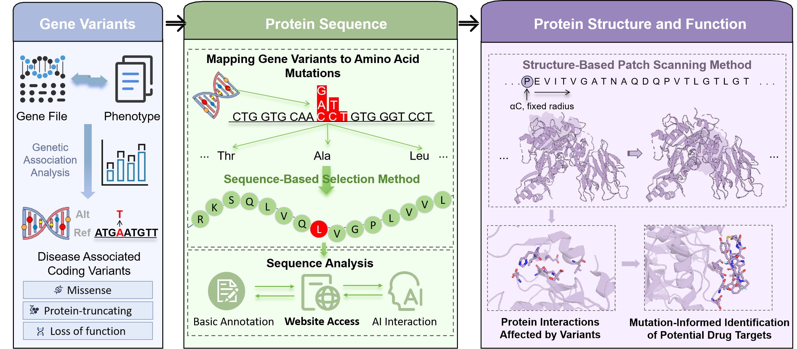

# COMPASS: COding variants MaPping onto AI predicted Structural hotSpots
A computational pipeline for structural and functional interpretation of disease-associated coding variants.
## Description
COMPASS is a computational framework designed to integrate whole-genome sequencing (WGS) data with experimentally determined and AI-predicted protein structures to systematically link disease-associated coding variants with functional structural regions and therapeutic targets. By combining sequence-based variant selection and structure-based patch scanning, COMPASS identifies disease-relevant substructures (functional hotspots) that accelerate genetics-driven drug discovery.
## Workflow Overview
The framework comprises three modules: (1) a sequence module that maps variants to transcript-specific amino acid sequences and consolidates association signals at the residue level; (2) a structure module that localizes disease-relevant hotspots in the protein; and (3) an annotation module that integrates functional annotations and automated literature mining to support interpretation.


## Docker Image
A Docker image for COMPASS, which includes R and all COMPASS-related packages pre-installed, is available on Docker Hub.The docker image can be pulled using
```
docker pull fengyn923/compass:0.1.0
```
## Examples
Sequence-based selection
```
Rscript coding_variants2amino_acids.R \
  --category=missense \
  --obj_nullmodel.file=obj.STAAR.UKB.Brain_Spine_Secondary.20250422.Rdata \
  --chr=6 \
  --gds.path=ukb.500k.wgs.chr6.pass.annotated.extend.gds \
  --gene_name=CRIP3 \
  --protein_sequence_selection_strategy=one-step
```
| Parameter                               | Example                                              | Description                                                                                                                                       |
| --------------------------------------- | ---------------------------------------------------- | ------------------------------------------------------------------------------------------------------------------------------------------------- |
| `--category`                            | `missense`                                           | Type of coding variants to analyze. Options: `missense`, `disruptive missense`, `ptv`, `plof`.                                                    |
| `--obj_nullmodel.file`                  | `obj.STAAR.UKB.Brain_Spine_Secondary.20250422.Rdata` | The pre-computed null model object was generated for the target phenotype.                                                                        |
| `--chr`                                 | `6`                                                  | Chromosome number containing the target gene.                                                                                                     |
| `--gds.path`                            | `ukb.500k.wgs.chr6.pass.annotated.extend.gds`        | Path to the annotated GDS file containing WGS variants for the specified chromosome.                                                              |
| `--gene_name`                           | `CRIP3`                                              | Name of the target gene for analysis.                                                                                                             |
| `--protein_sequence_selection_strategy` | `one-step`                                           | Strategy used to select representative amino acid sequences when multiple variants occur at the same position. Options: `one-step`, `stepwise`, `best-subset-selection`. |

Structure-based patch scanning
```
python patch_scanning.py \
  --i_pdb_file bcl2_chronic_lymphoid_leukemia.pdb \
  --i_variant_file BCL2_ENST00000333681_onestep_variant.txt \
  --radius 20 \
  --transcript ENST00000333681 \
  --gene_name BCL2 \
  --obj_nullmodel obj.STAAR.UKB.Chronic_Lymphoid_Leukemia.20250422.Rdata \
  --chr 18 \
  --category missense \
  --gds_path ukb.500k.wgs.chr18.pass.annotated.extend.gds \
  --num_patch 10
```

| Parameter          | Example                                                  | Description                                                                                                     |
| ------------------ | -------------------------------------------------------- | --------------------------------------------------------------------------------------------------------------- |
| `--i_pdb_file`     | `bcl2_chronic_lymphoid_leukemia.pdb`                     | Input PDB file containing the 3D structure of the target protein.                                               |
| `--i_variant_file` | `BCL2_ENST00000333681_onestep_variant.txt`               | Variant file listing disease-associated variants (output from the sequence-based selection step).               |
| `--radius`         | `20`                                                     | Radius (in Å) used to define a 3D patch centered on each residue’s Cα atom.                                     |
| `--transcript`     | `ENST00000333681`                                        | Ensembl transcript ID corresponding to the analyzed gene. The default setting is `standard`, which automatically selects the canonical transcript for analysis.|
| `--gene_name`      | `BCL2`                                                   | Name of the target gene for analysis.                                                                           |
| `--obj_nullmodel`  | `obj.STAAR.UKB.Chronic_Lymphoid_Leukemia.20250422.Rdata` | The pre-computed null model object was generated for the target phenotype.                                      |
| `--chr`            | `18`                                                     | Chromosome number containing the target gene.                                                                   |
| `--category`       | `missense`                                               | Variant category to analysis in the patch scanning.                                                             |
| `--gds_path`       | `ukb.500k.wgs.chr18.pass.annotated.extend.gds`           | Path to the annotated GDS file containing WGS variants for the specified chromosome.                            |
| `--num_patch`      | `10`                                                     | Specifies the number of top-ranked structural hotspots (patches) with the lowest P-values to be reported. A value of 999 outputs all identified hotspots. |
## Authors
Yannuo Feng, Yihao Peng, Shijie Fan, Shijia Bian, Jingjing Gong, Chang Lu, Xihao Li, Zilin Li

Contact: luc816@nenu.edu.cn, xihaoli@unc.edu, lizl@nenu.edu.cn

